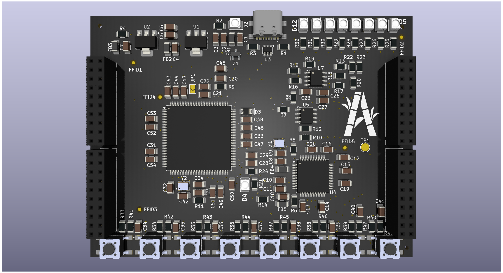
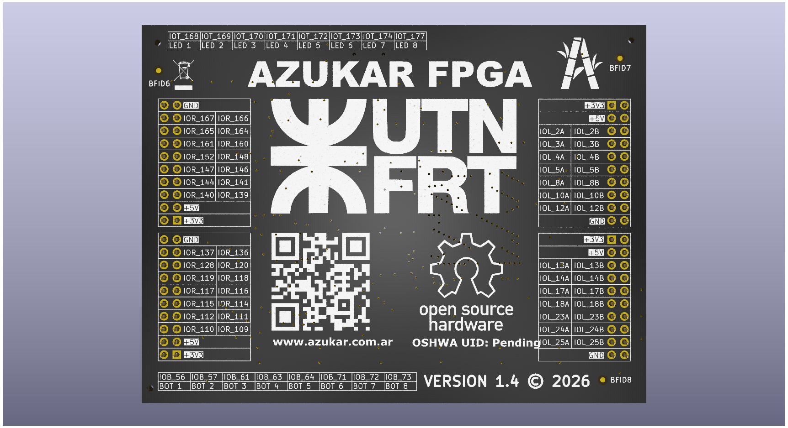

  <h1>  AZUKAR — FPGA Education Board</h1>
  <h1>UTN-FRT - Ingeniería Electrónica</h1>

[English](#english) | [Español](#español)

# English

## Overview

**AZUKAR** is an open-source FPGA development board designed for digital design education, laboratory training, and rapid prototyping.
It provides an accessible and reproducible hardware platform that enables students, makers, and engineers to explore HDL design, digital systems architecture, and FPGA-based applications using open toolchains.

The project follows open hardware principles and is optimized for academic environments, hands-on learning, and experimentation.

### Special Considerations

Assembly-first decisions were made to keep the board easy to build in a lab or at home: most parts use common, hand-solderable footprints (e.g., 1206, SOT-233-3, SOIC-8, 3528, SOT-23-6), and all components are placed on the TOP side of the PCB to simplify manual assembly and hot-plate reflow. The only parts that typically require extra precision or a different soldering technique are the FPGA (TQFP-144), the FTDI USB interface (LQFP-64), and the 3225 package crystals. As a trade-off, these assembly-friendly decisions make the routing denser and therefore increase via usage compared to a design that spreads parts across both PCB sides.

## Key Goals

The main idea behind AZUKAR is to make FPGA learning feel approachable and practical, especially in the context of digital design courses and hands-on training. To do that, the board is designed to work well with open-source FPGA toolchains and to keep the hardware design easy to understand, reproduce, and verify.

At the same time, this is meant to be a solid platform for lab work and academic use, not just a one-off prototype. The project is open to contributions and experiments from the community, so people can build on it, adapt it to their needs, and share improvements back.

## Features

AZUKAR is an FPGA-based digital logic platform with fully open hardware design files, created and maintained in KiCad 9. It is intended to work smoothly with open-source synthesis and programming workflows, so the learning experience doesn’t depend on proprietary tools.

From the start, the board is designed with education in mind: the I/O and peripherals are chosen to support typical lab exercises and digital design practice. The overall architecture is modular and extensible, so it can grow with new experiments, add-ons, and future improvements.

## Repository Structure

/docs -> Documentation of the board, pinout, datasheets, etc

/images -> Images

/project -> Kicad project

## Toolchain Compatibility

AZUKAR is designed to fit naturally into open-source FPGA workflows. In practice, that means you can synthesize designs with tools like Yosys, run place-and-route with NextPNR, and program the board using open programming utilities. The goal is to keep the HDL flow as vendor-independent as possible, so the same learning and development approach can be reused across projects.

## Educational Use

This board is intended to be used in real learning environments: university courses, digital electronics labs, and introductory FPGA workshops. It also works well for self-learning and experimentation at home, and it can serve as a practical base for small research prototypes where having an open, reproducible platform is a plus.

## Open Hardware

AZUKAR follows open hardware principles:

- Schematics and PCB files available
- Reproducible fabrication workflow
- Community-driven development

License details are available in the repository.

## Contributing

Contributions are welcome:

- Hardware improvements
- Documentation updates
- Example designs
- Testing and validation
- Educational material

Please open issues or pull requests.

## License

This project is released under an open-source hardware compatible license.  
See the LICENSE file for details.

## Attribution

If you use this project as a reference or as a base for derivative works, the CERN-OHL-P license requires preservation of attribution to the original AZUKAR project.

We strongly encourage including in documentation and repositories:
- A reference to this repository (link and name)
- The original author name
- The license notice

This helps maintain traceability and academic integrity within the open hardware community.

## Disclaimer

This project is an independent hardware design based on publicly available documentation of the Lattice iCE40HX FPGA family.
It is not affiliated with, endorsed by, or supported by Lattice Semiconductor.

---

# Español

## Descripción general

**AZUKAR** es una placa de desarrollo FPGA de código abierto diseñada para la educación en diseño digital, la capacitación de laboratorio y el prototipado rápido.
Proporciona una plataforma de hardware accesible y reproducible que permite a estudiantes, makers e ingenieros explorar el diseño en HDL, la arquitectura de sistemas digitales y aplicaciones basadas en FPGA usando toolchains abiertas.

El proyecto sigue principios de hardware abierto y está optimizado para entornos académicos, aprendizaje práctico y experimentación.

### Consideraciones especiales

Se tomaron decisiones orientadas al montaje para que la placa sea más fácil de construir en laboratorio o en casa: la mayoría de los componentes usan encapsulados comunes y soldables a mano (por ejemplo 1206, SOT-233-3, SOIC-8, 3528, SOT-23-6), y todos los componentes están ubicados en la cara TOP de la PCB para facilitar el armado manual y el soldado por reflow con cama caliente. Los únicos componentes que suelen requerir más precisión o una técnica de soldado diferente son la FPGA (TQFP-144), la interfaz FTDI del puerto USB (LQFP-64) y los cristales en encapsulado 3225. Como contrapartida, estas decisiones orientadas al ensamblado vuelven el ruteo más complejo y, por lo tanto, aumentan la cantidad de vías respecto de un diseño que distribuye componentes en ambas caras de la PCB.

## Objetivos principales

La idea principal de AZUKAR es que aprender FPGA sea más accesible y práctico, especialmente para materias de diseño digital y actividades de laboratorio. Por eso se buscó que la placa pueda trabajar con toolchains de FPGA de código abierto y que el diseño de hardware sea transparente, entendible y fácil de reproducir.

Además, el objetivo es que sirva como una plataforma sólida para uso académico y entrenamiento, no sólo como un prototipo aislado. El proyecto también está pensado para que la comunidad pueda aportar, probar ideas y experimentar, de forma que cualquiera pueda adaptarlo y mejorar lo que ya existe.

## Características

AZUKAR es una plataforma de lógica digital basada en FPGA, con archivos de diseño de hardware totalmente abiertos y desarrollados en KiCad 9. La placa está pensada para integrarse bien con herramientas de síntesis y programación de código abierto, para que el flujo de trabajo sea accesible y fácil de replicar.

También se priorizó el uso educativo: las entradas/salidas y los periféricos apuntan a cubrir prácticas típicas de laboratorio y ejercicios de diseño digital. La arquitectura, además, es modular y extensible, lo que permite sumar ideas, módulos y mejoras con el tiempo.

## Estructura del repositorio

/docs -> Documentación de la placa, pinout, hojas de datos, etc.

/images -> Imágenes

/project -> Proyecto de KiCad

## Compatibilidad con toolchains

AZUKAR está pensada para integrarse de forma natural con flujos de trabajo de FPGA de código abierto. En la práctica, esto incluye poder sintetizar con herramientas como Yosys, hacer place & route con NextPNR y programar la placa con utilidades abiertas. La idea es mantener el flujo de HDL lo más independiente posible del proveedor, para que lo aprendido sea reutilizable y fácil de replicar.

## Uso educativo

Esta placa está pensada para usarse en entornos reales de aprendizaje: cursos universitarios, laboratorios de electrónica digital y talleres introductorios de FPGA. También es muy útil para el autoaprendizaje y la experimentación, y puede servir como base para prototipos de investigación donde suma contar con una plataforma abierta y reproducible.

## Hardware abierto

AZUKAR sigue principios de hardware abierto:

- Esquemáticos y archivos de PCB disponibles
- Flujo de fabricación reproducible
- Desarrollo impulsado por la comunidad

Los detalles de la licencia están disponibles en el repositorio.

## Contribuciones

Las contribuciones son bienvenidas:

- Mejoras de hardware
- Actualizaciones de documentación
- Diseños de ejemplo
- Pruebas y validación
- Material educativo

Por favor, abrir issues o pull requests.

## Licencia

Este proyecto se publica bajo una licencia compatible con hardware abierto y de código abierto.  
Ver el archivo LICENSE para más detalles.

## Atribución

Si utilizás este proyecto como referencia o como base para obras derivadas, la licencia CERN-OHL-P exige que se preserve la atribución al proyecto original AZUKAR.

Se recomienda especialmente incluir en la documentación y repositorios:
- Una referencia a este repositorio (enlace y nombre)
- El nombre del autor original
- El aviso de licencia

Esto ayuda a mantener la trazabilidad y la integridad académica dentro de la comunidad de hardware abierto.

## Descargo de responsabilidad

Este proyecto es un diseño de hardware independiente basado en documentación de acceso público de la familia de FPGA Lattice iCE40HX.
No está afiliado a, avalado por, ni respaldado por Lattice Semiconductor.
